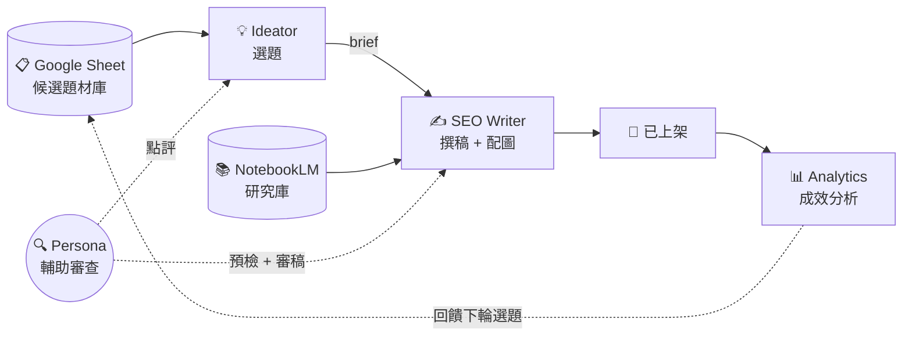

# Kvalley AI 內容生產系統

智谷網絡（Kvalley）對外公開的 AI 內容工作流範本。一條由 4 個 Claude Code agent 接力的內容生產線，從選題到上架全自動。

| Agent | 角色 | 自動化程度 |
|-------|------|-----------|
| 💡 Ideator | 選題策展人 | 每天 13:00 自動跑 |
| ✍️ SEO Writer | 寫稿 + 配圖 | 由你下指令觸發 |
| 🔍 Persona Reviewer | 讀者視角審稿 | 由 Writer 自動呼叫 |
| 📊 Analytics | 成效分析 + PDCA | 上架後手動觸發 |

[](LICENSE)
[]()
[]()

---

> [!IMPORTANT]
> ## 🔴 開工前必讀
>
> **這份 repo 是 template**，不是即用工具：
> - 公司內部同事 → clone 下來直接接智谷的 Sheet/NotebookLM
> - 外部 fork 使用者 → clone 下來改 `knowledge/` 換成自己品牌再用
>
> **不要直接改 `knowledge/` 核心規範**：`article-style.md`、`article-template.md`、`article-structures.md`、`geo-structure.md` 是智谷的內容方法論，請自己 fork 一份再改。**有改動建議直接開 issue 討論。**
>
> ### 用 Claude Code agent 操作（推薦）
>
> 切到 agent 目錄開 Claude Code，直接用中文下指令：
>
> ```bash
> cd agents/ideator && claude
> ```
>
> 然後對 agent 說：
> - 「**幫我找今天可以寫什麼**」 → Ideator 撈研究庫產 brief
> - 「**寫 01-queue/ 裡的 brief**」 → SEO Writer 開始寫稿
> - 「**用珊珊角度審這篇**」 → Persona Reviewer 點評
> - 「**分析這篇文章成效**」 → Analytics 跑 GA4/GSC 報表
>
> agent 啟動時會自動讀取自己的 `CLAUDE.md`，知道工作流程與品質規範。
>
> ### 手動指令（備用）
> ```bash
> git clone https://github.com/Kvalley-1/kvalley-ai-content-system.git
> cd kvalley-ai-content-system
> git pull origin master       # 同步最新版本
> git push origin master       # 推自己的修改（fork 後才有權限）
> ```

---

## 快速理解



詳細系統設計見 [docs/agents.md](docs/agents.md)、[docs/workflow.md](docs/workflow.md)。

---

## 你要做的事

### 第一次設定（只做一次）

```bash
# 1. Clone repo
git clone https://github.com/Kvalley-1/kvalley-ai-content-system.git
cd kvalley-ai-content-system

# 2. 安裝 Python 套件
cd automation
pip install google-genai google-auth google-auth-oauthlib google-api-python-client python-dotenv

# 3. 設金鑰（編輯 .env 填 GEMINI_API_KEY）
cp .env.example .env

# 4. 載入 LaunchAgent（每天自動跑 Ideator）
cp launchagents/com.kvalley.ideator-scan.plist.example \
   ~/Library/LaunchAgents/com.kvalley.ideator-scan.plist
# 編輯 .plist 把 {{REPO_ROOT}} {{USERNAME}} 換成你的值
launchctl load ~/Library/LaunchAgents/com.kvalley.ideator-scan.plist

# 5. NotebookLM 登入
nlm login
```

完整步驟見 [docs/setup.md](docs/setup.md)（如果還沒寫，依照 README 指引即可）。

### 改成你自己的內容（fork 使用者必做）

| 檔案 | 改什麼 |
|------|--------|
| [knowledge/brand_voice.md](knowledge/brand_voice.md) | 改成你的品牌語氣 |
| [knowledge/services.md](knowledge/services.md) | 改成你的服務清單 |
| [knowledge/personas/](knowledge/personas/) | 改成你的目標讀者 persona |
| [knowledge/competitors.md](knowledge/competitors.md) | 改成你的競品清單 |
| [knowledge/audience.md](knowledge/audience.md) | 改成你的目標受眾 |
| `agents/*/memory/`（空的） | Claude 會逐步累積你個人的偏好和歷史 |

**重點：** `knowledge/` 是共享規則，`memory/` 是你個人累積——分清楚。

---

## 文件導覽

### 想了解這個系統怎麼運作

| 文件 | 說明 |
|------|------|
| [CLAUDE.md](CLAUDE.md) | 系統主腦的角色與品質底線（agent 自動讀，使用者也建議讀過） |
| [docs/agents.md](docs/agents.md) | 4 個 agent 的完整職責與紅線 |
| [docs/workflow.md](docs/workflow.md) | 端到端 6 階段流程 |
| [docs/research-libraries.md](docs/research-libraries.md) | Google Sheet 與 NotebookLM 的角色分工 |
| [docs/quality-assurance.md](docs/quality-assurance.md) | 三層 Persona 把關 + GEO v2 可引用性 |

### 寫稿規範（SEO Writer 會自動載入）

| 檔案 | 說明 |
|------|------|
| [knowledge/article-style.md](knowledge/article-style.md) | 文章風格與排版規範 |
| [knowledge/article-structures.md](knowledge/article-structures.md) | 6 種 H2 骨架庫 |
| [knowledge/geo-structure.md](knowledge/geo-structure.md) | GEO v2 規範（AI 引擎可引用性） |
| [knowledge/writing-styles/](knowledge/writing-styles/) | 6 種寫作風格選用指南 |

---

## Repo 結構

```
kvalley-ai-content-system/
├── agents/                      # 4 個 agent 設定（各自有 CLAUDE.md）
│   ├── ideator/
│   ├── seo-writer/
│   ├── persona-reviewer/
│   └── analytics/
├── knowledge/                   # 共用知識庫（品牌、persona、SEO 規範）
├── pipeline/                    # 文章生產線四階段
│   ├── 01-queue/                # brief 等寫稿
│   ├── 02-in-progress/          # 寫稿中
│   ├── 03-ready/                # 完稿等審
│   └── 04-published/            # 已上架
├── automation/                  # Python 腳本 + LaunchAgent 範本
├── docs/                        # 系統設計文件
├── CLAUDE.md                    # 主系統角色與品質底線
└── README.md
```

---

## 有問題找誰

| 問題類型 | 找誰 |
|----------|------|
| 系統設計疑問 | 開 GitHub Issue |
| 內容方法論討論 | 開 GitHub Issue |
| 商業合作 / 顧問服務 | 透過 [www.kvalley.biz](https://www.kvalley.biz) 聯絡表單 |
| Bug 回報 | 開 GitHub Issue 附 reproduce 步驟 |

---

## 關於智谷

智谷網絡（Kvalley）是台灣企業培訓與組織發展顧問，專注於讓 AI 被編進企業的工作流。

🔗 [www.kvalley.biz](https://www.kvalley.biz)

---

## License

[CC BY-SA 4.0](LICENSE) — 可自由參考、改作、商用，需註明來源並以相同方式分享。

---

> 🤖 本系統每天在智谷內部實際運行。所有機制都是**已部署、已驗證**的生產環境，不是規劃中。
