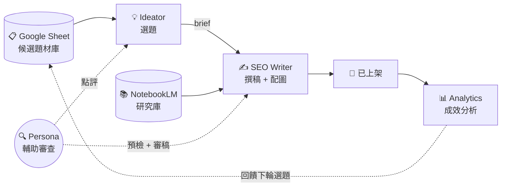

# Kvalley AI Content System

> 一條由 AI Agent 接力的內容生產線。智谷網絡（Kvalley）對外公開的 AI 工作流範本。
>
> Clone 下來，裝上 Claude Code，就能在你的電腦跑起一模一樣的系統。

[](LICENSE)
[]()
[]()

---

## 快速理解



詳細系統設計見 [docs/agents.md](docs/agents.md)、[docs/workflow.md](docs/workflow.md)。

---

## Repo 結構

```
kvalley-ai-content-system/
├── agents/                      # 4 個 AI Agent 的設定
│   ├── ideator/                 # 主題策展人
│   ├── seo-writer/              # 內容編輯 + 配圖
│   ├── persona-reviewer/        # 讀者視角審查員
│   └── analytics/               # 數據監控
├── knowledge/                   # 共用知識庫（品牌語氣、persona、SEO 規範）
├── pipeline/                    # 文章生產線四階段資料夾
├── automation/                  # 自動化 Python 腳本 + LaunchAgent 範本
├── docs/                        # 系統設計文件
├── LICENSE                      # CC BY-SA 4.0
└── README.md                    # 本檔
```

---

## 安裝指南

### 前置需求

- macOS（LaunchAgent 自動化目前只支援 macOS）
- Python 3.10+（建議用 Anaconda）
- [Claude Code](https://claude.com/claude-code)（跑 agent 用）
- Google 帳號（建 Sheet + NotebookLM）
- [Gemini API Key](https://aistudio.google.com/apikey)（免費額度足夠）

### Step 1：Clone Repo

```bash
git clone https://github.com/xuano104/kvalley-ai-content-system.git
cd kvalley-ai-content-system
```

### Step 2：Python 環境

```bash
cd automation
pip install -r requirements.txt  # （如果 requirements.txt 還沒建，裝這些）
# pip install google-genai google-auth google-auth-oauthlib google-api-python-client python-dotenv
```

### Step 3：設定金鑰

```bash
cp automation/.env.example automation/.env
# 用編輯器打開 automation/.env，填入你的 GEMINI_API_KEY 等
```

### Step 4：Google Sheet + NotebookLM

1. **建 Google Sheet：** 複製我們的 [題材庫範本](https://docs.google.com/spreadsheets/d/<YOUR_SHEET_ID>/edit)（如果是內部同事，用原本那張）
2. **申請 Google OAuth：** 依 Google 指示建立 OAuth Client，下載 `credentials.json` 放到 `automation/`
3. **NotebookLM：** 用 [nlm CLI](https://github.com/google/notebooklm) 登入你的 Google 帳號

### Step 5：設定自動化

```bash
# 複製 LaunchAgent plist 範本到系統位置
cp automation/launchagents/com.kvalley.ideator-scan.plist.example \
   ~/Library/LaunchAgents/com.kvalley.ideator-scan.plist

# 編輯檔案，把 {{REPO_ROOT}} 和 {{USERNAME}} 替換成你的值
# 然後載入
launchctl load ~/Library/LaunchAgents/com.kvalley.ideator-scan.plist
```

上架後 Sheet 自動同步也用同樣方式設定 `com.kvalley.pipeline-sync-published.plist`。

### Step 6：在 Claude Code 開 Agent

打開 Claude Code，切到 repo 根目錄後：

```bash
cd agents/ideator   # 選你要跑的 agent
claude              # 開 Claude Code，它會讀 CLAUDE.md
```

每個 agent 有自己的 CLAUDE.md，Claude Code 會自動載入。

### Step 7：第一次跑

- **Ideator：** 對 Claude 說「幫我找今天可以寫什麼」
- **SEO Writer：** 對 Claude 說「開始寫 01-queue/ 裡的 brief」
- **Analytics：** 對 Claude 貼 GA4 / GSC 數據，說「分析這篇文章」

---

## 設定你自己的內容

Clone 下來的是**智谷的內容配置**。你要改成自己的：

1. **`knowledge/brand_voice.md`** — 改成你的品牌語氣
2. **`knowledge/services.md`** — 改成你的服務清單
3. **`knowledge/personas/*.md`** — 改成你的目標讀者 persona
4. **`knowledge/competitors.md`** — 改成你的競品清單
5. **`agents/*/memory/`**（空的）— Claude 會逐步累積你個人的偏好和歷史

**重點：** `knowledge/` 是共享規則，`memory/` 是你個人累積——分清楚。

---

## 文件導覽

- [docs/agents.md](docs/agents.md) — 4 個 Agent 的完整職責與紅線
- [docs/workflow.md](docs/workflow.md) — 端到端 6 階段流程
- [docs/research-libraries.md](docs/research-libraries.md) — Google Sheet 與 NotebookLM 的角色分工
- [docs/quality-assurance.md](docs/quality-assurance.md) — 三層 Persona 把關 + GEO v2 可引用性

---

## 關於智谷

智谷網絡（Kvalley）是台灣企業培訓與組織發展顧問，專注於讓 AI 被編進企業的工作流。

🔗 [www.kvalley.biz](https://www.kvalley.biz)

---

## License

[CC BY-SA 4.0](LICENSE) — 可自由參考、改作、商用，需註明來源並以相同方式分享。

---

> 🤖 本系統每天在智谷內部實際運行。所有機制都是**已部署、已驗證**的生產環境，不是規劃中。
