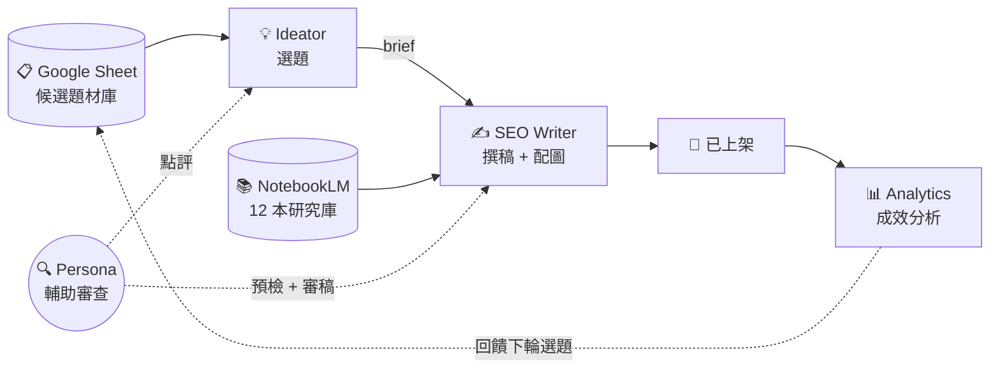

# Kvalley AI Content System

> 一條由 AI Agent 接力的內容生產線。智谷網絡（Kvalley）對外公開的 AI 工作流示範。

[](LICENSE)
[]()
[]()

---

## What is this

這不是一個「AI 寫文章工具」，這是一個**完整的 AI 工作流示範**——從選題、研究、撰稿、配圖、審核到成效分析全自動接力，由人負責最終品質。

智谷網絡每天用這套系統生產內容。**本 repo 把架構、分工、流程完整攤開**，讓企業在規劃自己的 AI 工作流時有一個真實、可參考的範本。

---

## System Overview



---

## Core Agents

**3 個主力 Agent + 1 個輔助：**

| Agent | 角色 | 職責 |
|-------|------|------|
| 💡 **Ideator** | 主題策展人 | 每天 13:00 自動掃 NotebookLM + Gemini 評估 → 寫入 Google Sheet。內容負責人要寫文章時，現場生 brief |
| ✍️ **SEO Writer** | 內容編輯 + 配圖 | 讀 brief、查 NotebookLM 撈國際研究、融合改寫、串 Nano Banana 自動生成 6 張配圖 |
| 📊 **Analytics** | 數據監控 | 讀 GA4 / GSC 數據、文章健康評分、找標題優化機會、每月給策略建議 |
| 🔍 **Persona** | 輔助審查員 | 扮演 HR 主管與數位轉型推手，在選題、寫稿前、寫稿後各把關一次 |

詳細職責與工作規範 → [docs/agents.md](docs/agents.md)

---

## Two Parallel Research Libraries

這套系統的關鍵設計之一——**兩個研究庫平行運作，各自服務不同階段：**

| 研究庫 | 服務對象 | 用途 |
|--------|---------|------|
| **Google Sheet** | Ideator | 選題用的候選題材中心，15 種狀態動態標記 |
| **NotebookLM**（12 本） | SEO Writer | 寫稿時撈國際研究引用（HBR / McKinsey / WEF / Josh Bersin 等） |

**為什麼不合併？** 選題需要看「整批候選」做取捨，Sheet 的表格結構最適合；寫稿需要對單一主題深度 query，NotebookLM 的 RAG 架構最適合。

詳細 → [docs/research-libraries.md](docs/research-libraries.md)

---

## Workflow in 80 Minutes

一篇文章從訊號到上架，**約 80–110 分鐘**。人介入時間合計約 30–50 分鐘，其餘全自動。

```
訊號偵測 (13:00 自動)
    ↓
選題 + Persona 點評    ← 人介入 10–15 分鐘
    ↓
寫稿 + 自動配圖 (30–45 分鐘)
    ↓
Persona 審稿 (5–10 分鐘)
    ↓
人的最終把關 + WP 上架  ← 人介入 10–20 分鐘
    ↓
成效回饋 (每月)
```

詳細六階段 → [docs/workflow.md](docs/workflow.md)

---

## Three Persona Checkpoints

AI 寫出來容易「技術上沒錯、但讀者無感」。這套系統的解法：**讀者視角的審查跑三次**。

| 階段 | 執行者 | 問題 |
|------|--------|------|
| 選題前 | Ideator + Persona | 這個標題目標讀者會不會點？ |
| 寫稿前 | SEO Writer + Persona | 這個 brief 寫出來會不會共鳴？ |
| 寫稿後 | Persona（量化評分） | 珊珊 18/25、推手 15/20、GEO v2 五項全過才放行 |

詳細 → [docs/quality-assurance.md](docs/quality-assurance.md)

---

## Tech Stack

| 層 | 工具 |
|---|------|
| LLM | Claude（推理）、Gemini 2.5 Flash（批次評估） |
| 圖像生成 | Google Nano Banana |
| 研究庫 | NotebookLM（12 本主題筆記本） |
| 資料中心 | Google Sheet + Apps Script |
| 自動化 | macOS LaunchAgent（cron + WatchPaths） |
| 分析 | Google Analytics 4 + Google Search Console |
| MCP 整合 | `notebooklm-mcp`、`nano-banana-mcp` |
| 發布 | WordPress |

---

## Docs

- [agents.md](docs/agents.md) — 四個 Agent 的完整職責與紅線
- [workflow.md](docs/workflow.md) — 端到端六階段流程
- [research-libraries.md](docs/research-libraries.md) — Google Sheet / NotebookLM 的角色分工
- [quality-assurance.md](docs/quality-assurance.md) — 三層 Persona 把關 + GEO v2 可引用性

---

## About Kvalley

智谷網絡（Kvalley）是台灣企業培訓與組織發展顧問，專注於讓 AI 被編進企業的工作流。

**我們的核心主張：** 不是教你用 AI 工具，是幫你把 AI 編進工作流裡。

**核心服務：**
- 企業 AI 診斷（五階段：診斷 → 代建 → 共建 → 自建 → 持續優化）
- AI 能力卡牌工作坊
- 個人 AI 技能診斷
- 策略共識營、主管培訓、績效管理

🔗 [www.kvalley.biz](https://www.kvalley.biz)

---

## License

本 repo 採用 [CC BY-SA 4.0](LICENSE) 授權——可自由參考、改作、商用，需註明來源並以相同方式分享。

---

> 🤖 本系統每天在智谷內部實際運行。本 repo 提到的所有機制都是**已部署、已驗證**的生產環境，不是規劃中。
