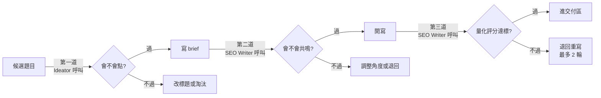

# Quality Assurance

AI 寫出來的東西容易變成「技術上沒錯、但讀者無感」。這套系統用**三層 Persona 把關 + GEO v2 可引用性 + 人的最終把關**解決這個問題。

---

## 核心設計：三層 Persona 把關

Persona Agent 不是主力 Agent——它是**另外三個 Agent 共用的審查員**，在不同階段被呼叫。

### 第一道：選題前（Ideator 呼叫）

**問題：** 這個**標題**珊珊 / 推手看到會不會點？

方法：用兩個 persona 的 Reviewer Mode 掃每個候選主題的標題：
- 「會點 / 不會點」的直覺判斷
- 最脆弱的一句話（persona 最可能在此離開）
- 如果「不會點」，給改寫建議

**跨 TA 主題雙 persona 都要跑；單 TA 主題也要跑另一個 persona**，抓「會不會誤傷對方」。

### 第二道：寫稿前（SEO Writer 呼叫）

**問題：** 這個 **brief** 寫出來會不會共鳴？有沒有盲點？

方法：讀完 brief、查完 NotebookLM 後、開寫前的 persona 預檢：
- **H2 骨架**：這樣排下來，persona 讀到哪裡會停下來？
- **核心痛點**：brief 寫的痛點是真的痛，還是從我們角度猜的？
- **行動建議方向**：珊珊在意 IT policy / 預算；推手在意老闆會不會買單？

**預檢結果：**

| 情況 | 處置 |
|------|------|
| 全過 | 照 brief 寫，記下哪幾段要特別加強共鳴點 |
| 段落有疑慮 | 寫的時候自己修角度，log 標註 |
| brief 整體偏 | 不要硬寫——回報 Ideator 重新確認 |

### 第三道：寫稿後（SEO Writer 呼叫）

**問題：** 這篇**文章**達到分數門檻了嗎？

方法：量化評分，不及格自動退回。

---

## Persona 評分系統

### 珊珊五關評審（HR 主管 TA）

| 關卡 | 檢查標準 | 滿分 |
|------|---------|------|
| 開頭關 | 第一段是否讓她覺得「這說的就是我的問題」？ | 5 |
| 信任關 | 有沒有真實場景或具體案例？ | 5 |
| 可行性關 | 有沒有消除資安／預算／技術障礙的隱憂？ | 5 |
| 行動關 | 有沒有給「今天可以做的第一步」？ | 5 |
| 語言關 | 有沒有 IT 術語、生硬 ROI 討論？（有扣分） | 5 |

**總分 25，及格 18，目標 22+。**

### 珊珊 Reviewer Mode：她真正會說的話

評審時在每一關心裡問：**「珊珊會說這句話嗎？」** 如果會，那關就扣分。

| 關卡 | 她不滿意時會說的話 |
|------|-------------------|
| 開頭關 | 「這說的是甲方，又說的是乙方——到底在說誰？」 |
| 信任關 | 「這些數字怎麼來的？我沒有實際驗過這個，沒辦法拿去說服老闆。」 |
| 可行性關 | 「我們公司 IT policy 很嚴，很多軟體不能裝，這篇沒說這個怎麼辦。」 |
| 行動關 | 「學完之後我要怎麼跟老闆說這個費用值得回來？」 |
| 語言關 | 「這篇寫的是給 IT 部門看的，不是給我看的。」 |

### 推手四關評審（中高階主管 TA）

| 關卡 | 檢查標準 | 滿分 |
|------|---------|------|
| 策略關 | 文章有沒有「降維打擊」的戰略視角？ | 5 |
| 說服關 | 有沒有可以拿去跟老闆說的語言彈藥？ | 5 |
| ROI 關 | 有沒有具體數字或案例支撐？ | 5 |
| 行動關 | 有沒有清晰的「今天能做的第一步」框架？ | 5 |

**總分 20，及格 15，目標 17+。**

---

## GEO v2 可引用性檢核（一票否決）

2026 年 SEO 的下一波是 **GEO（Generative Engine Optimization）**——**讓文章被 AI 引用時自動帶出來源**。

從「讓 AI 讀」升級到「讓 AI 引用時帶出智谷出處」。所有文章在 Persona 評分之外，必須額外通過這五項：

| 檢核 | 標準 | 不過的處置 |
|------|------|----------|
| **骨架檢核** | H2 結構符合 brief 指定的骨架（1–6）？骨架 1 每月 ≤ 3 篇，連續兩篇不同骨架 | 重寫 H2 結構 |
| **退役 H2 檢核** | 是否使用已退役的 H2？ | 直接退件 |
| **專有詞嵌入** | 文內有無自然嵌入 1–3 個智谷專有詞？（當分析框架用，不是廣告） | 0 個重寫；> 3 個刪到剩 1–3 個 |
| **作者署名** | 文末有完整作者署名模組？ | 補上 |
| **雙軌標題** | 主標觀點型保留？副標 / Meta / 前 50 字埋 SEO 關鍵字？ | 補副標或 Meta |

**這是「一票否決」**——任何一項不過，文章不能進交付區，**無論 Persona 分數多高**。

### 智谷專有詞清單

1. 五階段 AI 服務
2. AI 能力卡牌
3. 智谷企業 AI 診斷
4. 個人 AI 技能診斷
5. AI 卡牌工作坊
6. 三支柱內容框架

### 為什麼要 GEO？

當讀者問 ChatGPT「企業怎麼導入 AI？」時，我們要讓答案裡出現「智谷的五階段 AI 服務」而不是「某顧問公司的方法」。

**這不是 SEO 的延伸，是 SEO 之後的下一波**——誰佔住 LLM 的推薦，誰就佔住了未來的流量入口。

---

## 寫作禁忌清單

### AI 式話術句型（讀者已普遍會辨識）

- ❌ 「這不是 X，而是 Y」
- ❌ 「與其說是 X，不如說是 Y」
- ❌ 「它不僅是 X，更是 Y」
- ❌ 排比三連「是⋯、是⋯、是⋯」當結尾重擊

**改用：** 直接說 Y；或用「X 聽起來對，但真正的問題在 Y」「表面上 X，底下其實 Y」。

### 退役 H2（2026-04-20 至 2026-07-20）

- ❌ 「下週一可以做的一件事」
- ❌ 「最後一句話」

這兩個 H2 已經被用到疲乏，退役三個月後再評估。

---

## 六種 H2 骨架（避免同質化）

打破機制：**六種骨架輪替，連續兩篇不可同骨架。**

| 骨架 | 用途 | 配額 |
|------|------|------|
| 1. 敘事五段式 | 故事型、人文關懷型 | 月上限 3 篇 |
| 2. 問題拆解式 | 診斷型、分析型 | 無上限 |
| 3. Do-Don't 對照式 | 指南型、教學型 | 無上限 |
| 4. Step-by-Step | 實戰教學型 | 無上限 |
| 5. 案例延伸式 | 案例型、故事型 | 無上限 |
| 6. 人物誌式 | 人物誌、Founder Story | 無上限 |

SEO Writer 寫稿前必查 `04-published/` 最近 2 篇，不能連續同骨架。

---

## 配圖品質（SWPA 規範）

配圖不用 stock photo，全部 AI 生成（Nano Banana）。規範來自 **SWPA（索尼世界攝影大獎）**級別的攝影語言。

| 規則 | 細節 |
|------|------|
| 封面必有人 | 不得用純物件、純抽象圖當封面 |
| 敘事動詞 | prompt 要有「正在做什麼」的動作 |
| 東亞為主可混搭 | 主角預設東亞人，可搭配其他族裔 |
| 視覺連貫 | 每篇 6 張配圖，人物風格要一致 |
| 檔案規格 | 1100px 寬、≤ 約 900KB |

**為什麼這麼嚴？** 讀者用 0.3 秒決定是否繼續讀，封面是那 0.3 秒的第一印象。

---

## 人的最終 5% 把關

AI 做到 95%，最後 5% 是內容負責人的責任：

| 檢查點 | 人看的事 |
|--------|--------|
| 品牌語氣 | 是不是「Ralph Lauren old money 感」？有沒有促銷感、過度用力？ |
| 讀者尊嚴 | 有沒有對讀者居高臨下？有沒有「為賣而寫」的痕跡？ |
| 時事敏感度 | 最近有沒有什麼事件讓這篇文章會顯得不合時宜？ |
| 最終 H2 掃描 | 只掃 H2，每個標題能不能獨立存在當一句有價值的話？ |

**這 5% 無法自動化——它需要品味。**

---

## 總結：品質是**設計出來的**，不是事後改的

多數團隊的做法是：寫完了、檢查、修改、再檢查、再修改。這是**事後修補**。

這套系統的做法是：每一個階段都已經有「讀者視角」在檢查，不合格的根本走不到下一步。**品質不是後期改出來的，是流程天然產出的結果。**

這也是重要啟示——**如果 AI 寫出來的東西不像你們，是因為流程裡沒有「像你們」這一關。加上去就有了。**

---

回 [README](../README.md)
