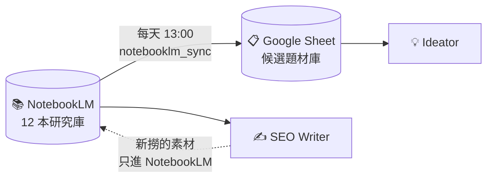

# Dual Research Libraries

這套系統有**兩個研究庫，平行運作，各自服務不同階段**——這是關鍵設計，不是冗餘。

---

## 為什麼是兩個，不是一個？

| | Google Sheet | NotebookLM |
|---|-------------|-----------|
| 結構 | 表格（row × column）| RAG（向量檢索）|
| 適合 | **看整批做取捨** | **對單一主題深度 query** |
| 服務 | Ideator 選題 | SEO Writer 寫稿 |
| 狀態 | 15 種 status 動態標記 | 只儲存 source，無狀態 |

選題時內容負責人要**一眼看 5–10 篇候選做取捨**——Sheet 的表格結構最適合。寫稿時要對某主題「撈有 3 個引用的反直覺觀點」——NotebookLM 的 RAG 架構最適合。

**強硬整合反而拖慢兩邊，平行分工最有效。**

---

## 第一庫：Google Sheet 中央題材庫

**服務對象：** Ideator

### 每天 13:00 自動寫入

macOS LaunchAgent `com.kvalley.ideator-scan` 觸發：

```
daily_scan.py 四步流程
├── notebooklm_sync   掃 12 本研究庫，新 source 寫入 Sheet A/B/C
├── evaluator         讀 E 欄為空的列，Gemini 2.5 Flash 評估填 D-H
├── daily_picker      挑 5 篇今日候選，寫入 daily-picks-YYYY-MM-DD.md
└── health            健康狀況寫入 ideator-health.md
```

### Sheet 欄位

| 欄 | 內容 | 誰寫入 |
|---|------|--------|
| A | 日期 | notebooklm_sync 自動 |
| B | 網址（source URL） | notebooklm_sync 自動 |
| C | NotebookLM Keywords | notebooklm_sync 自動 |
| D | Search terms（3–5 個繁中搜尋詞） | Gemini 自動評估 |
| E | **Status**（15 種） | 各 Agent 或人工 |
| F | User（珊珊 / 推手 / 跨 TA） | Gemini 自動評估 |
| G | Product（31 個智谷產品挑一） | Gemini 自動評估 |
| H | 建議文章標題（10–25 字） | Gemini 自動評估 |

### 15 種 Status

**Ideator 階段：** 新 / ideator 推薦 / ideator 觀察 / ideator 不推薦

**Chloe 決策：** Chloe 選定但還沒寫 / Chloe 選定，已寫 / 改寫舊文 / 暫緩

**Pipeline 生產：** Brief 完成 / 寫作中 / 送 persona 審核中 / 審核未過修改中 / 已完稿 / 已上架

**終止：** 捨棄

### 業務對齊機制

Evaluator 讀 `kv-key-activities.md`（從 Notion 每天 09:15 同步），把**當季活動**當硬約束：

- 對得上活動 → 偏 recommend，標題往活動角度包裝
- 完全脫節 → 嚴格處理（observe/reject），不讓選題跟業務脫節

### 上架後的狀態同步

LaunchAgent `com.kvalley.pipeline-sync-published` 監看 `04-published/`：

```
內容負責人把 .md 檔搬到 04-published/
     ↓
macOS 偵測到資料夾變動
     ↓（10 秒內）
pipeline_sync.py 自動觸發
     ↓
讀檔案的 source_url → 對 Sheet B 欄找列
     ↓
Sheet E 欄 status 自動改「已上架」
```

**結果：** 重複題材永遠不會被推薦第二次。

---

## 第二庫：NotebookLM 主題研究庫

**服務對象：** SEO Writer

### 目前的 12 本

| 研究庫 | source 數 | 主要內容 |
|--------|----------|---------|
| AI 組織變革 | 18 | 大規模 AI 導入對組織結構的衝擊 |
| 企業 AI 導入 | 14 | Use case、ROI、失敗案例 |
| AI Cards Guide to Strategic Implementation | 37 | 卡牌工作坊的理論基礎 |
| 主管培訓 | 15 | 中階主管培訓設計、TWI |
| 領導風格 | 9 | 領導力研究、Transformational |
| 職場溝通 | 5 | 溝通技巧、回饋文化 |
| 拒絕內耗 | 2 | 效率、會議文化 |
| 職場倦怠 | 3 | Burnout、Engagement |
| 工程監造與執行流程 | 1 | 特殊專案 |
| 同理心溝通 | 0 | 規劃中 |
| OKR | 0 | 規劃中 |
| 績效面談 | 0 | 規劃中 |

**累計約 100+ 份國際研究 source。**

### 串接的國際研究平台

每本研究庫的素材來自**全球一線研究機構**：

**一級來源（必搜）：**
HBR、McKinsey、Forbes、BCG、Korn Ferry、Gallup、Deloitte、WEF、Gartner、Forrester

**二級來源：**
Fortune、Fast Company、Chief Learning Officer、Josh Bersin、DDI、SHRM、Simon Sinek、CCL

**三級來源（在地化補充）：**
經理人、天下、104、哈佛商業評論繁中版

### SEO Writer 怎麼用

1. **對照 brief 的 NotebookLM 關鍵字** → 找對應 notebook
2. **用 `notebook_query`** → 對該 notebook 提問，取得有引用來源的答案
3. **跨主題時用 `cross_notebook_query`** → 一次搜多本
4. **撈不到素材時** → 用 NotebookLM 內建的「在網路上搜尋新來源」補新文獻，關鍵字可參考 Sheet 的 search_terms 欄
5. **每篇至少撈 3 個有引用的 insight**

### 品質標準

- 不直接翻譯 NotebookLM 的回答——融合改寫成智谷語氣
- 優先用國際來源抬高內容高度
- 若 NotebookLM 回傳 auth 錯誤 → 跑 `nlm login`

---

## 兩庫之間的單向關係



**關鍵原則：**
- NotebookLM 的 source URL 會匯進 Sheet 當選題候選
- 但 SEO Writer 寫稿時用 search_terms 找到的新文獻，**只加進 NotebookLM，不回寫 Sheet**
- 兩庫各自成長、互不依賴

### 為什麼不雙向同步？

如果寫稿時找到的新文獻自動回 Sheet，會造成：
- Sheet 被「已在寫的文章相關素材」淹沒，選題時雜訊過大
- 重複推薦已經在處理的主題
- 資料流向複雜，維護成本高

**單向流動 + 各自成長 = 穩定可維護的架構。**

---

## source_url 鐵律

每個 brief、每篇文章的檔案頂端必須有一行：

```
**source_url**：https://...（從 Sheet B 欄帶入的完整原網址）
```

三種情況：

| 情況 | 寫法 |
|------|------|
| 從 Sheet 挑的題 | 填 Sheet B 欄的 URL |
| 手動選題（不是從 Sheet 來） | 寫 `**source_url**：手動選題` |
| Brief 沒寫 | 不能動工——回 Ideator 問清楚 |

**這是整條自動化的錨點。沒有 `source_url`，pipeline_sync 抓不到，Sheet 狀態不會更新。**

---

## 可以怎麼類比到你的企業？

| 我們的場景 | 你可能的場景 |
|-----------|-------------|
| Google Sheet（整批候選、狀態機） | CRM（商機管道、階段標記）|
| NotebookLM（單一主題深度 query） | 產品知識庫、技術文件庫、客戶案例庫 |
| 跨系統自動同步 | ETL pipeline、狀態機、workflow engine |

**共同結構：** 一個管「狀態」，一個管「知識」，平行運作，在不同階段服務不同角色。

---

下一步：[quality-assurance.md](quality-assurance.md)
