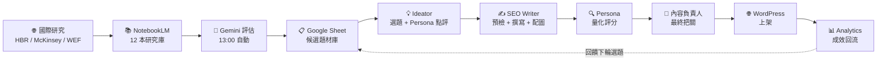
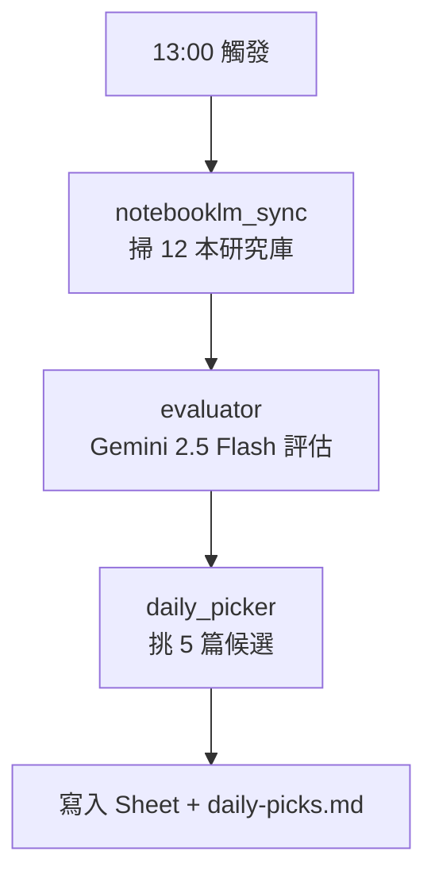
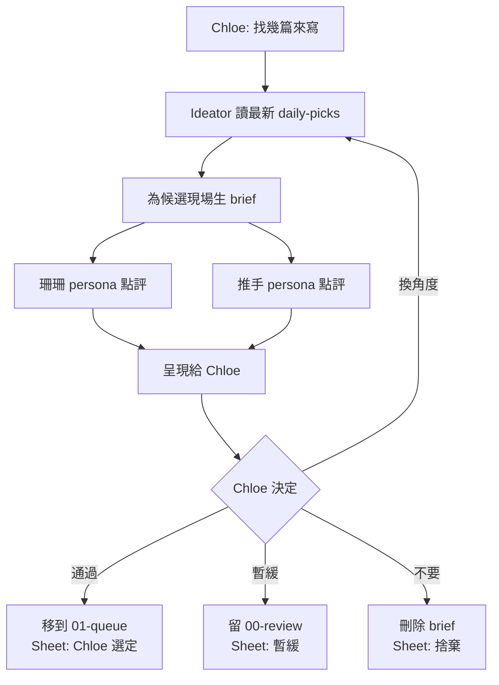
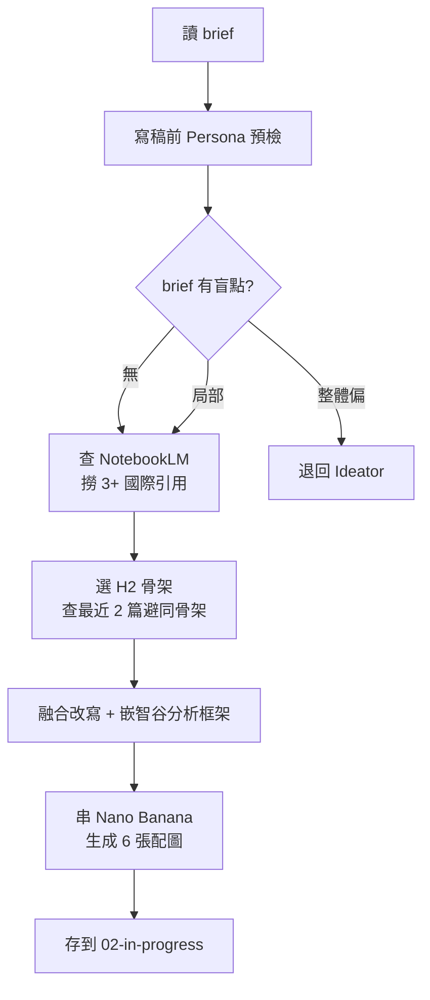
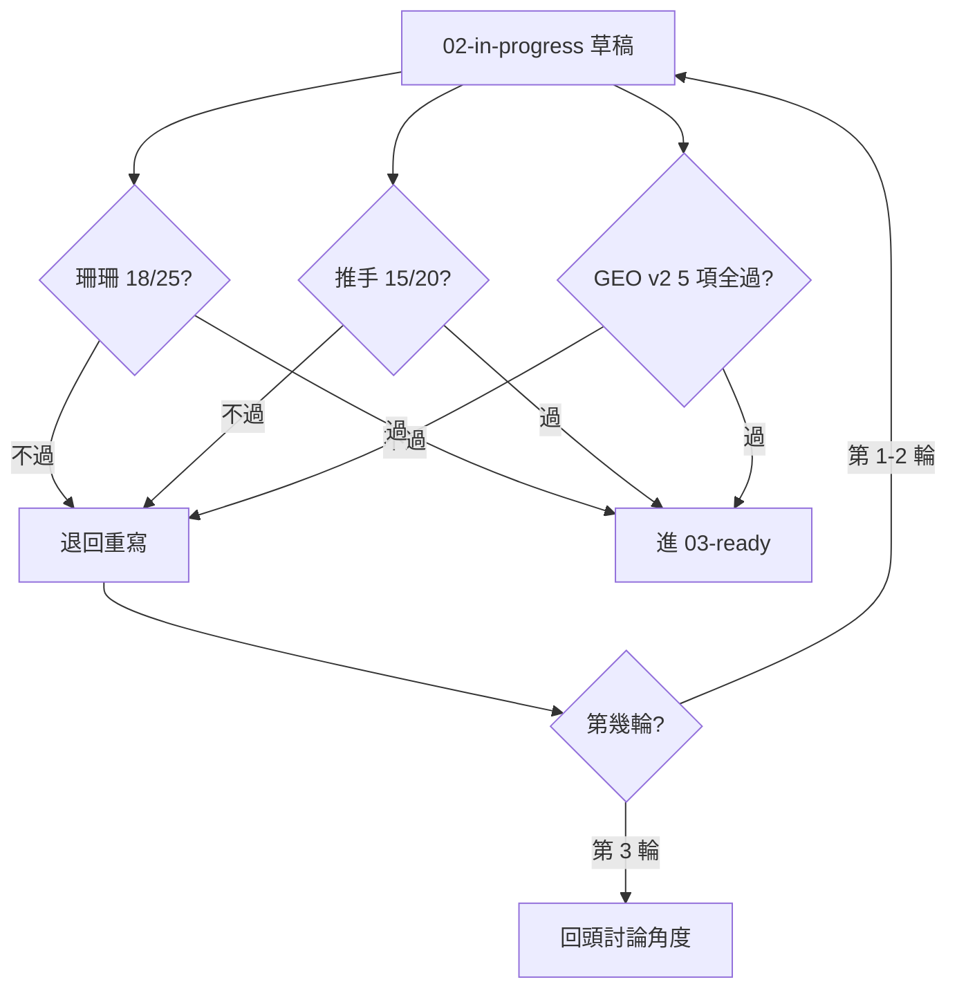
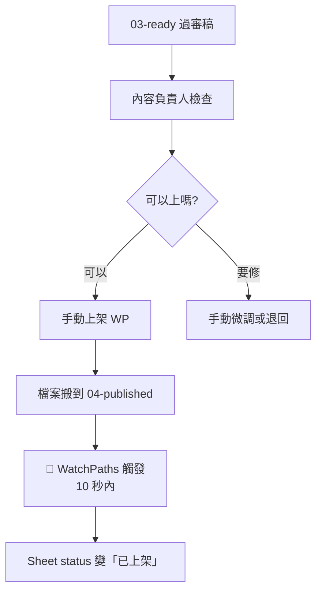
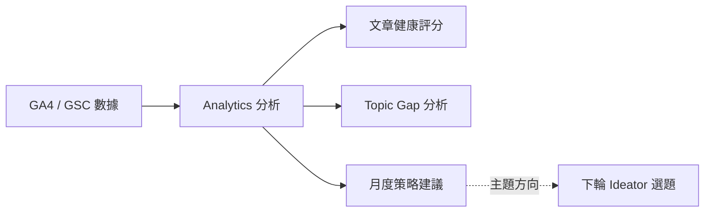

# End-to-End Workflow

從一則國際研究的新文章，到上架 WordPress 並開始累積成效——完整六階段。

---

## 總覽



---

## 第一階段：訊號偵測（每天 13:00 自動）

**觸發：** macOS LaunchAgent `com.kvalley.ideator-scan`
**產出：** Google Sheet 新增候選題材 + 當日 picks 清單



### Gemini 評估會填的欄位

| 欄位 | 內容 |
|------|------|
| Search terms | 3–5 個繁中搜尋詞 |
| Status | recommend / observe / reject |
| User | 珊珊 / 推手 / 跨 TA |
| Product | 從 31 個智谷產品挑最精準的 |
| 建議標題 | 10–25 字 |

### 業務對齊機制

Gemini 讀 `kv-key-activities.md`（從 Notion 每天 09:15 同步），把**當季活動**當硬約束：

| 情況 | 處理 |
|------|------|
| 對得上某場活動 | 偏 recommend，標題往活動角度包裝 |
| 完全脫節 | 嚴格處理（observe/reject） |

---

## 第二階段：選題 + Persona 點評

**觸發：** 內容負責人：「今天要寫什麼？」
**產出：** 選好的 brief 存到 `pipeline/01-queue/`



### Persona 點評產出

對每個候選主題的標題，兩個 persona 都跑一遍：

- 「會點 / 不會點」的直覺判斷
- 最脆弱的一句話（persona 最可能在此離開）
- 如果「不會點」，給改寫建議

**跨 TA 主題雙 persona 都要跑；單 TA 主題也要跑另一個 persona**，抓「會不會誤傷對方」。

---

## 第三階段：寫稿前 Persona 預檢 + 寫稿 + 自動配圖

**觸發：** SEO Writer 接手 `01-queue/` 的 brief
**產出：** 文章草稿 + 6 張配圖，存到 `02-in-progress/`



### 寫稿前 Persona 預檢

Ideator 點評過「會不會點」，SEO Writer 寫稿前用 persona 視角掃 brief 的三件事：

- **H2 骨架**：這樣排下來，persona 讀到哪裡會停下來？
- **核心痛點**：brief 寫的痛點是真的痛，還是從我們角度猜的？
- **行動建議方向**：珊珊在意 IT policy / 預算；推手在意老闆會不會買單？

### NotebookLM 研究流程

SEO Writer 寫稿時用 NotebookLM：

1. 對照 brief 的 NotebookLM 關鍵字，找對應 notebook
2. 用 `notebook_query` 撈有引用來源的答案
3. 跨主題時用 `cross_notebook_query` 一次搜多本
4. 需要更多素材時用「在網路上搜尋新來源」（可用 Sheet 的 search_terms 當指引）
5. 每篇至少 3 筆有引用的 insight

**關鍵：新撈的素材只進 NotebookLM，不用回寫 Google Sheet——兩邊平行，不互相同步。**

---

## 第四階段：寫稿後 Persona 審核

**觸發：** SEO Writer 寫完後呼叫 Persona 審核
**產出：** 審核報告，過關搬到 `03-ready/`、不過退回重寫



**最多兩輪修改**——第三輪不該發生，發生 = brief 方向有問題，回 Ideator。

---

## 第五階段：人的最終把關

**觸發：** 內容負責人打開 `03-ready/` 檢查
**產出：** 文章上架 WordPress，檔案搬到 `04-published/`



### 自動同步機制

LaunchAgent `com.kvalley.pipeline-sync-published` 監看 `04-published/`：

- 檔案一進資料夾 → 自動觸發 `pipeline_sync.py`
- 讀檔案裡的 `source_url` → 對 Sheet B 欄找對應列
- **10 秒內** Sheet status 自動變「已上架」

**不需要人工標記——搬檔動作 = 狀態更新。**

---

## 第六階段：成效回流

**觸發：** 內容負責人定期貼入 GA4 / GSC 數據
**產出：** Analytics 月度回顧 → 影響下輪選題



---

## 資料夾狀態機

```
pipeline/
├── 00-review/       ← Ideator 生完、Chloe 還沒決定
├── 01-queue/        ← Chloe 通過、等 SEO Writer 取件
├── 02-in-progress/  ← SEO Writer 寫作中、等 Persona 審
├── 03-ready/        ← 審核過關、等 Chloe 最終把關
└── 04-published/    ← 已上架 WP
```

每個資料夾對應一個 Google Sheet status：

| 資料夾 | Sheet status |
|--------|-------------|
| 00-review/ | Chloe 選定但還沒寫 |
| 01-queue/ | Brief 完成 |
| 02-in-progress/ | 寫作中 / 送 persona 審核中 / 審核未過修改中 |
| 03-ready/ | 已完稿 |
| 04-published/ | 已上架 |

**檔案搬到哪、Sheet status 就是哪。** 狀態不會失真。

---

## 端到端時間估算

| 階段 | 時間 |
|------|------|
| 訊號偵測（自動）| 每天 13:00，秒級 |
| 選題決策（人介入）| 10–15 分鐘（選 5 篇） |
| 寫稿 + 配圖 | 30–45 分鐘 |
| Persona 審核（自動）| 5–10 分鐘（含修改 1 輪） |
| 人的最終把關 | 10–20 分鐘 |
| WP 上架 | 10 分鐘 |
| **總計** | **約 80–110 分鐘/篇** |

**人介入時間合計：約 30–50 分鐘。其餘全自動。**

---

下一步：[research-libraries.md](research-libraries.md)
